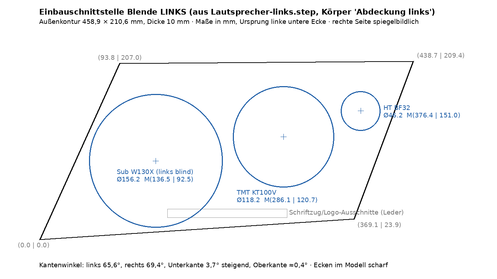

# Referenzanalyse (Stand: R01–R03, weitere Referenzen folgen)

## R01 – Trapezförmige Lautsprecherblende (Türverkleidung)

- **Kontur:** asymmetrisches Trapez mit großen, weich auslaufenden Eckradien. Die
  Oberkante läuft schräg, die Unterkante ist gerade. Die Form folgt der Türlinie.
- **Muster, zwei Zonen:**
  1. *Konzentrisches Lochfeld* (Kreis, exzentrisch oben rechts): Rundlöcher auf
     Kreisbahnen, Lochgröße nimmt nach außen zu. Das erzeugt einen Tiefeneffekt.
  2. *Radiale Langlöcher* um das Lochfeld: Strahlenmuster, die Schlitzlänge wächst
     zum Rand hin. Die Schlitze werden an der Außenkontur beschnitten, mit
     gleichbleibendem Randsteg.
- **Logo-Schild** unten links: abgesetzte, erhabene Fläche mit eigenem Radius. Das
  Logo ist darauf geprägt bzw. erhaben.
- **Oberfläche:** Aluminium matt (gebürstet/gestrahlt). Die Randfacette ist
  glanzgedreht bzw. poliert, dadurch entsteht eine umlaufende Lichtkante.
- **Wirkung:** Dynamik durch das Strahlenmuster. Der Blick geht zum Zentrum
  (Hochtöner). Hochwertigkeit entsteht durch den Kontrast matt/glänzend.

## R02 – Runde Lautsprecherblenden auf Carbon

- **Kontur:** Kreis mit breiter, polierter Kegelfacette (Diamantschnitt-Optik), in
  eine schwarze Einfassung eingesetzt.
- **Muster:** Rundlochperforation auf Spiralen/Kreisbahnen. Die Lochgröße variiert
  radial, dadurch entsteht ein Moiré-/Wellen-Effekt. Mittig sitzt ein kleines
  Signet-Element.
- **Logo:** am unteren Rand in einem schmalen Kreissegment-Schild.
- **Oberfläche:** feinmatt gestrahlt, Facette hochglanz. Kontrast zu Carbon und Leder.
- **Wirkung:** präzise, technisch und uhrwerkhaft. Zwei Größen bilden eine Familie.

## R03 – Regallautsprecher mit polierter Front

- **Front:** vollflächig hochglanzpolierte Metallplatte (Spiegeleffekt) mit
  sichtbaren Senkschrauben als bewusstes Gestaltungselement.
- **Gehäuse:** klare Quaderform, bordeauxrot lackiert (Farbkontrast zu Chrom).
- **Ständer:** Freischwinger aus gebogenem Rundrohr mit Klemmschellen. Die
  Konstruktion ist offen sichtbar.
- **Wirkung:** handwerkliche Präzision, „ehrliche“ Befestigung, Luxus durch Politur.

## Gemeinsame Designsprache (Zwischenfazit)

| Merkmal | Ausprägung |
|---|---|
| Material | Aluminium bzw. Edelmetalloptik, in Kontrast zu dunklen oder farbigen Umgebungen |
| Oberflächenkontrast | matt gestrahlt/gebürstet ↔ glanzgedrehte/polierte Kanten und Facetten |
| Muster | Perforation mit **Verlauf** (Lochgröße/Schlitzlänge ändert sich radial) |
| Geometrie | Kreis/Radius-Zentrum, weiche Großradien, gleichmäßige Randstege |
| Details | abgesetztes Schild für Signet oder Marke, sichtbare, präzise Verbindungselemente |

## Fertigungsbezug (Aluminium)

- Perforationsmuster: **Laserschneiden** oder **Stanzen/Nibbeln** bei Blech
  (0,8–1,5 mm), **CNC-Fräsen/Bohren** bei Massivteilen. Stege ≥ Blechdicke einhalten.
- Glanzfacetten: **Diamantdrehen/-fräsen** (Glanzschnitt), danach Klarlack oder Eloxal.
- Matt: Glasperlstrahlen, dann **Eloxal E6** (Kombination E6 + Glanzschnitt ist
  in der Automobilausstattung üblich).
- Verlaufsmuster lassen sich parametrisch erzeugen. Das ist ideal für CadQuery und
  Fusion (Muster aus einer Formel statt Einzelgeometrie).

## Einbauumgebung: Schwalbennester der Frauscher 650 Alassio (Web-Bilder U01–U12)

Bildquellen: `01_referenzen/README.md` (Herstellerbilder, nur verlinkt).

**Lage:** Je ein Fach in der linken und rechten Cockpit-Innenwand, etwa auf Höhe der beiden
Einzelsitze bzw. knapp dahinter (U02, U07). Darüber läuft eine Edelstahl-Haltestange (U01, U02).

**Form:** Liegende Öffnung, annähernd **Parallelogramm/Trapez** mit großen Eckradien. Die
vordere Kante ist schräg (ca. 40–50°) und nimmt die Diagonale der äußeren
Edelstahl-Zierleiste bzw. des Bordwand-Designausschnitts auf (U06, U11). Das Fach ist nach
unten tiefer, innen mit einer kleinen Stufe/Ablage (U01).

**Material/Oberflächen:**
- Rahmen: umlaufende **polierte Edelstahl-Einfassung** (schmales Profil, Hochglanz).
- Auskleidung: **Teak** mit sichtbarer Maserung (blaues Boot) bzw. farbig lackiert/gepolstert
  (türkis, weißes Boot) – also je nach Ausstattung variabel.
- Umgebung: hochglänzender **Gelcoat in Metallic-Blau** (fast spiegelnd), Teakdeck mit schwarzen
  Fugen, blaues Leder mit Rautensteppung, polierter Edelstahl, Frauscher-Schriftzug.

**Geschätzte Maße (nur aus Fotos, ±30 %, am Boot nachmessen!):**
Öffnung ca. 550–700 mm lang × 220–300 mm hoch, Tiefe ca. 120–180 mm; Rahmenbreite ca. 8–12 mm.
Maßstab: Bootsbreite ca. 2,1 m (Draufsicht U07), Becher im Fach (U01).

**Vorhandene Lautsprecher:** Runde JL-Audio-Marine-Lautsprecher mit Speichengitter sitzen
(je nach Baujahr/Ausstattung) unter dem Armaturenbrett (U04, U05), in der Seitenwand auf
Fußhöhe vor dem Schwalbennest (U02, U03) und im Heck-Fußraum (U10). Laut Auftrag gehört der
Lautsprecher selbst zu einem anderen Projekt; die Blende muss sich nur an dessen Einbau anpassen.

**Mögliche Positionen der Alu-Blende:**
1. **In der Rückwand bzw. Stirnseite des Schwalbennests** – Blende als Einsatz, der Lautsprecher
   sitzt hinter dem Fach. Die Kontur folgt der Parallelogramm-Form des Fachs.
2. **Seitenwand vor dem Fach** (heutige Lautsprecherposition, U02): runde oder trapezförmige
   Blende, deren Schrägkante parallel zur Vorderkante des Fachs läuft.
3. **Als Zierblende über dem ganzen Fach** mit perforiertem Feld und integriertem Rahmen, der die
   Edelstahl-Einfassung ersetzt oder ergänzt (größter Eingriff, braucht Klärung mit Frauscher/Eigner).

**Designfolgerungen für die Blende:**
- Die **Diagonale** ist das prägende Motiv des Boots (Zierleiste, Fach, Designausschnitt):
  Schlitze oder Verlauf der Perforation im gleichen Winkel führen.
- Die umgebenden Metallteile sind **hochglanzpoliert**: Glanzfacette bzw. -rand der Blende
  (vgl. R01/R02) passt. Eine mattgestrahlte, natur oder dunkel eloxierte Fläche setzt sich gegen
  das spiegelnde Blau ab.
- Farbe: Aluminium natur/Titan oder **dunkelblau eloxiert** passend zum Rumpf; Kontrast zum Teak.
- Marine-Umgebung: seewasserbeständige Legierung (z. B. EN AW-5083/6082), Eloxal ≥ 20 µm
  oder Pulver, Edelstahl-A4-Schrauben; keine Kontaktkorrosion zum Edelstahlrahmen (Isolierung).

## Einbauschnittstelle aus dem LS-Projekt (verbindlich)

Das Lautsprecherprojekt liegt im privaten Repo **Privat-Meisterwerke**,
`Projekte/Schwalbennester Alassio/`. STEP-Dateien und Messdaten bleiben dort, hier stehen nur
die Schnittstellenmaße. Maschinenlesbar: `parameter.json` → `einbauschnittstelle`.

- Pro Seite ein 3D-gedrucktes Lautsprechergehäuse (Korpus 119 mm + Deckel 20 mm = **139 mm tief**),
  das in der Öffnung des Schwalbennests sitzt. Bestückung: Visaton BF 32 (Hochtöner),
  KT 100 V (Tiefmitteltöner), W 130 X (Subwoofer, nur rechts aktiv; links Blinddeckel).
- Heutige Front: schwarze Gitter in einer **Lederabdeckung, 10 mm dick**. In der STEP-Datei ist das
  der Körper „Abdeckung links“. **Die Alu-Blende ersetzt diese Abdeckung.**
- Außenkontur 458,9 × 210,6 mm, schiefes Viereck mit geraden Kanten (links 65,6°, rechts 69,4°,
  Unterkante 3,7° steigend). Die Ecken sind im Modell scharf. Die rechte Seite ist spiegelbildlich.

| Treiber | Ausschnitt | Mittelpunkt ab linker unterer Ecke (mm) |
|---|---|---|
| BF 32 (Hochtöner) | Ø 46,2 | 376,4 / 151,0 |
| KT 100 V (Tiefmitteltöner) | Ø 118,2 | 286,1 / 120,7 |
| W 130 X (Subwoofer, links blind) | Ø 156,2 | 136,5 / 92,5 |

- Das eigene Foto des Boots (Privat-Meisterwerke, `Referenzbilder/03-Schwalbennest.jpeg`) bestätigt:
  Parallelogramm-Öffnung mit poliertem Edelstahlrahmen, Teakauskleidung, Rumpf dunkles Marineblau.
- Damit ist Position 1 (Blende in der Öffnung des Schwalbennests, vor dem Lautsprechergehäuse)
  festgelegt. Die geschätzten Maße im Abschnitt oben sind durch diese Werte ersetzt.

## Abgrenzung / Schutzrechte

Die Referenzen stammen von Burmester (Marke, Design, Signet). Das neue Bauteil
übernimmt **Prinzipien** (Verlauf, Oberflächenkontrast, Facette), aber **keine**
Kontur, kein Lochbild und kein Logo 1:1. Für das Schild ist ein Kienbacher-eigenes
oder neutrales Signet vorgesehen.

## Offene Fragen an Kienbacher (vor Phase 3)

1. ~~Funktion/Einsatz~~ → geklärt: Lautsprecherblende im Schwalbennest der Frauscher 650 Alassio.
   Position: in der Öffnung des Schwalbennests, ersetzt die Lederabdeckung (siehe Einbauschnittstelle).
2. ~~Reale Maße~~ → aus dem LS-Projekt übernommen. Offen: **Stückzahl** (Prototyp, Kleinserie, Serie).
   Davon hängt die Fertigung ab (Fräsen, Laser, Stanzen).
3. **Blech** (Perforation, leicht) oder **Massivteil gefräst** (Facetten, Tiefe)?
4. Signet auf dem Schild: Kienbacher-Logo, neutral oder frei?
5. Folgen noch weitere Referenzen?
