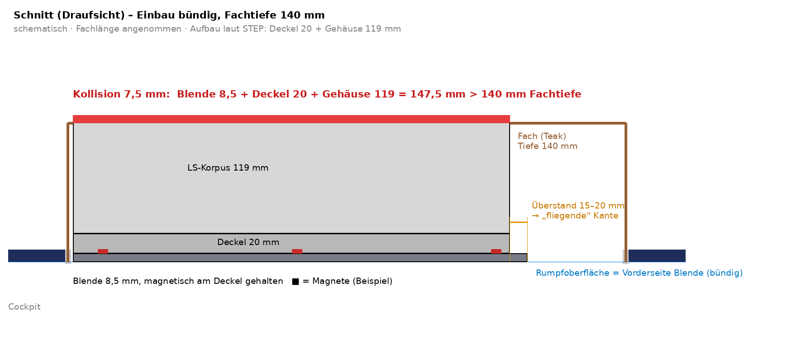

# Anforderungen Blende Schwalbennest (Stand 30.09.2026, von Alexander Brühl bestätigt)

## Einbau

- Der LS-Korpus (Deckel 20 mm + Gehäuse 119 mm, siehe `parameter.json` → `einbauschnittstelle`)
  steckt im Schwalbennest. Das Fach ist **140 mm tief**. Der Korpus sitzt an einem Ende der
  Öffnung, der Rest des Fachs bleibt offen.
- Die **Vorderseite der Blende schließt außen bündig mit dem Bootsrumpf ab** (Ebene des
  Edelstahlrahmens).
- **Blendendicke max. 8,5 mm** (die heutige Lederabdeckung mit 10 mm ist zu dick).
- **Befestigung mit Magneten** am LS-Korpus (Deckel). Keine sichtbaren Schrauben.
- **Überstand 15–20 mm** über den Korpus, nur an der Seite zum offenen Fach. Von der Seite
  gesehen entsteht eine schlanke, „fliegende“ Kante mit Schattenfuge dahinter.
- Treiberausschnitte (BF 32, KT 100 V, W 130 X) laut `einbauschnittstelle`. Die Blende gibt es
  links und rechts, spiegelbildlich.

## ⚠️ Offener Konflikt in der Aufbautiefe

Blende 8,5 + Deckel 20 + Gehäuse 119 = **147,5 mm > 140 mm Fachtiefe**, also **7,5 mm zu viel**.
Mögliche Auflösungen (Entscheidung offen):
1. Die 140 mm werden ab Rahmenaußenkante gemessen, und Wand oder Rahmen bringen zusätzliche Tiefe.
   Dann bitte nachmessen.
2. Den Deckel des Korpus um ≥ 7,5 mm dünner machen oder die Blende in den Deckel einlassen
   (Tasche im Deckel).
3. Die Korpus-Rückseite anpassen oder schräg zuschneiden, falls die Fachrückwand der Rumpfform folgt.

## Designvarianten

| | Variante 1 – Leder | Variante 2 – Alu gefräst (**wahrscheinlicher**) |
|---|---|---|
| Aufbau | belederte Blende auf Träger | aus dem Vollen gefräst, EN AW-6082/5083 |
| Schalldurchlass | Lautsprechergitter | gebohrte oder geschlitzte Perforation |
| Logo | geprägt | eingefräst, optional LED-hinterleuchtet |
| Farbe/Oberfläche | Leder dunkelblau, hellgrau, schwarz oder sattelbraun | offen (natur, titan, dunkelblau eloxiert; Glanzfacette) |
| Überstehende Kante | Abschlussleiste in Optik der Edelstahl-Einfassung des Schwalbennests | gefräste Kante, ggf. Glanzfacette |

## Offen

- Auflösung des Tiefenkonflikts (siehe oben)
- Maße der Öffnung (Länge oben/unten, Höhe) und Lage des Korpus im Fach (Ende Richtung Bug oder Heck)
- Logo/Signet (Meisterwerke Marina, Kienbacher, neutral)
- Variante 2: Perforation gebohrt oder geschlitzt, LED ja/nein (Bauraum für LED-Streifen und
  Diffusor in 8,5 mm)
- Stückzahl
