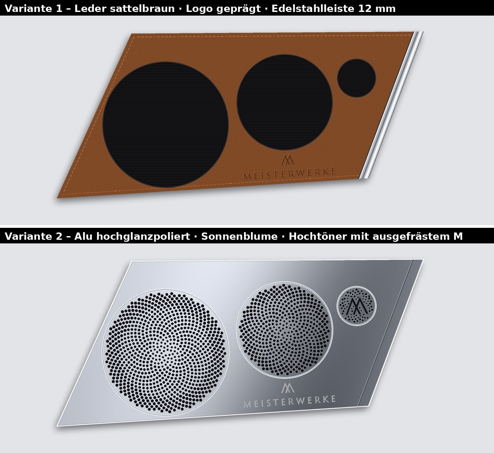
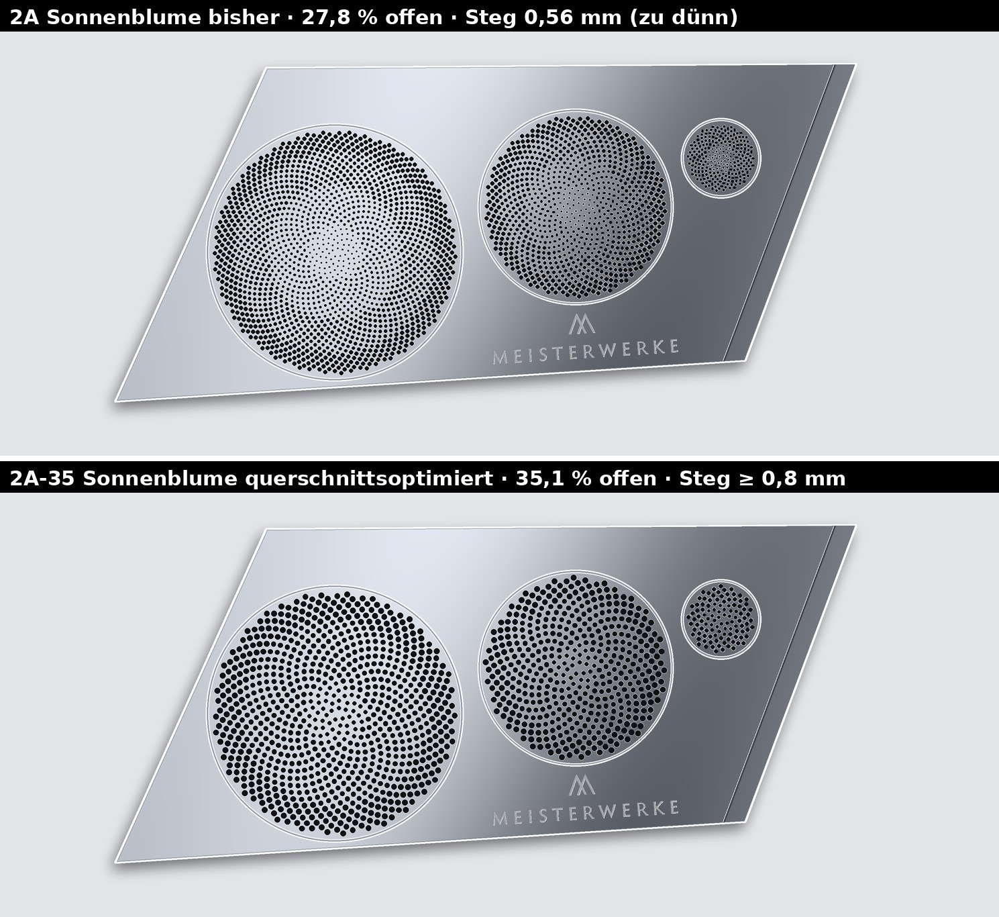
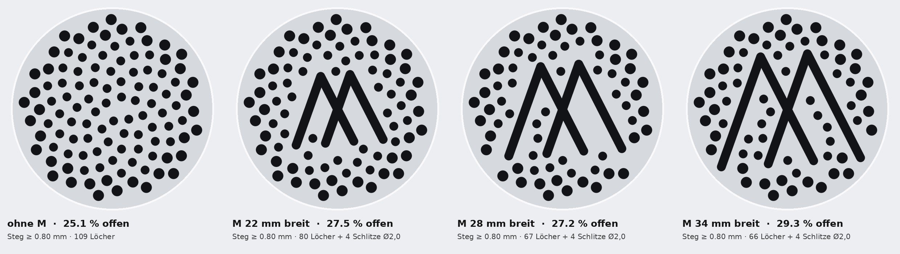
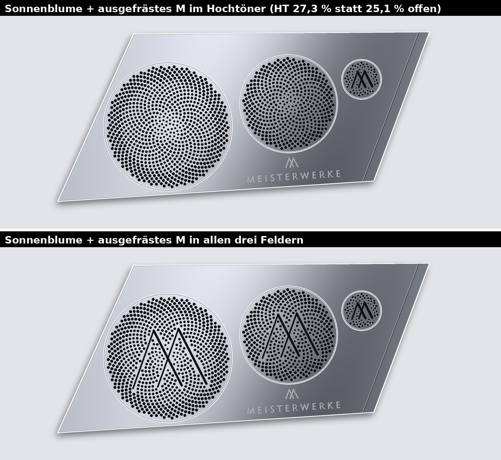
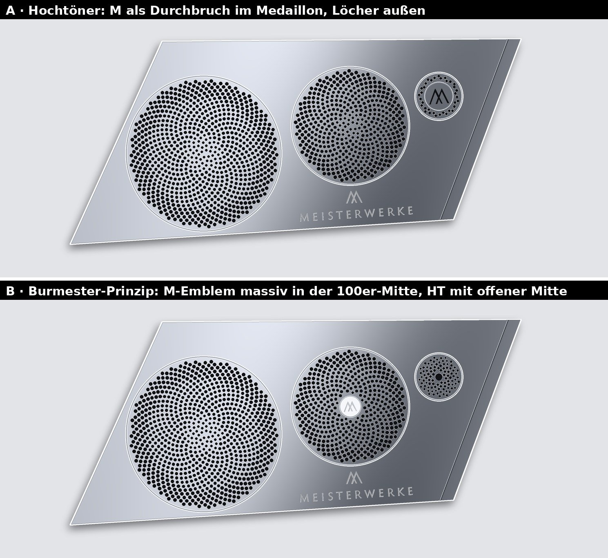
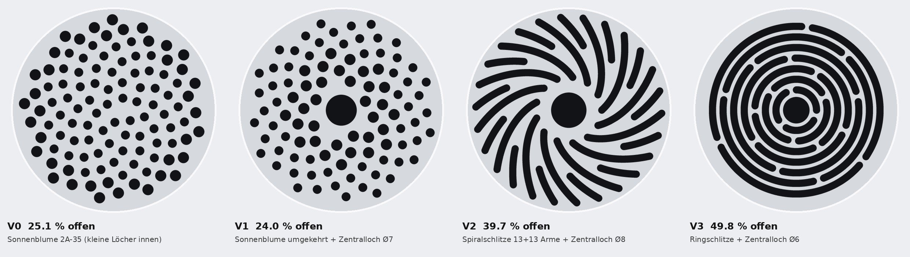
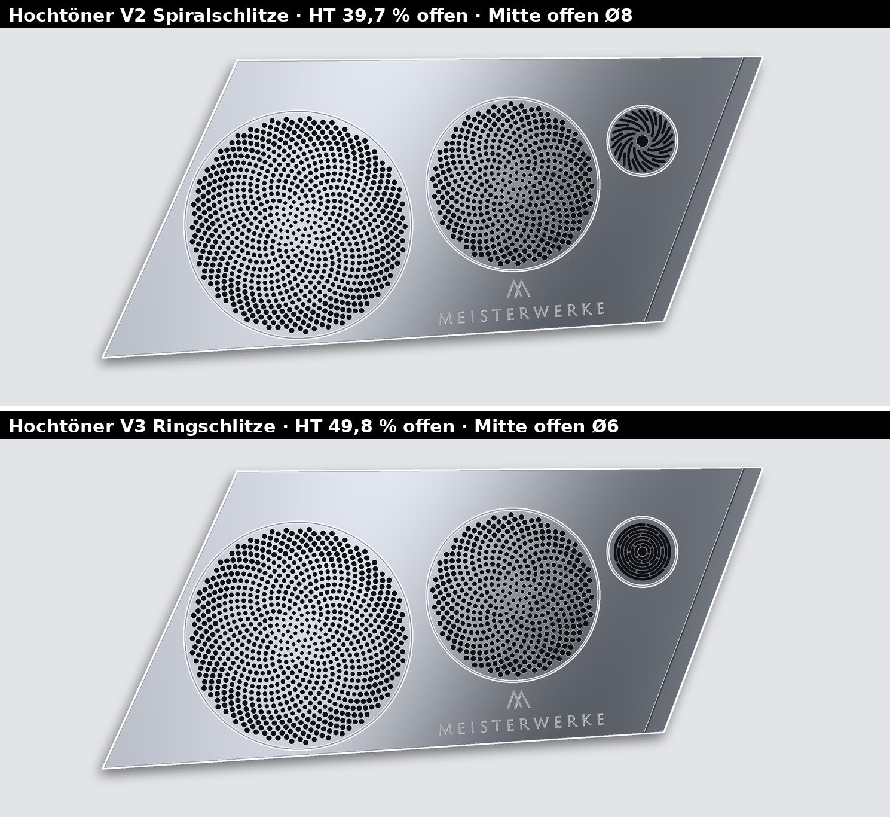
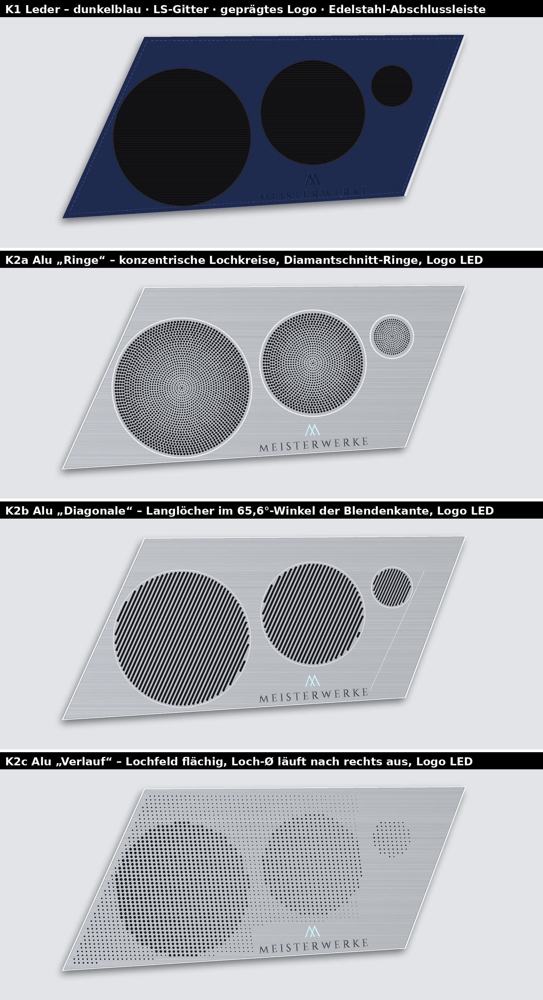

# Designkonzepte Blende Schwalbennest

## Aktuelle Vorschau (Stand 30.09.2026) – immer zwei Varianten

**Variante 1 – Leder sattelbraun:** Lautsprechergitter schwarz, Logo blind geprägt, Ziernaht, an der
überstehenden rechten Kante eine **polierte Edelstahl-Abschlussleiste, 9 mm breit** (so breit wie die
Einfassung des Schwalbennests im Rumpf, aus dem Foto gemessen: oben ≈ 9 mm, links ≈ 8 mm; **auf Wunsch
verbreitert auf 12 mm**).

**Variante 2 – Aluminium hochglanzpoliert mit Lochmuster (gewählt: 2C+, siehe unten):** Logo eingefräst (ohne Farbe, keine LED),
schlanke gefräste **Kantennut** (1,2 mm breit, **12 mm** innen → 12-mm-Kantenband) parallel zur rechten Kante als optische Nähe zur
Edelstahleinfassung, Diamantschnitt-Ring um jedes Lochfeld. Das Lochmuster soll ein **Blickfang** sein
statt eines technischen Rasters (vgl. Burmester). Drei Entwürfe:

| Muster | Idee | Wirkung |
|---|---|---|
| **2A „Sonnenblume“** | Phyllotaxis-Spirale (goldener Winkel 137,5°), Loch-Ø wächst von innen nach außen | organisch, spiralige Linien schimmern je nach Blickwinkel |
| **2B „Welle“** | konzentrische Lochkreise, Loch-Ø wellenförmig moduliert | Ringe scheinen zu „schwingen“, Sinnbild Schallwelle |
| **2C „Strahlenkranz“** | Zentrum als Sonnenblumenfeld, außen Kranz aus Langlöchern im Wechsel lang/kurz | dynamisch, Blick zieht zur Treibermitte |

Fertigung (für alle drei): Lochfelder von hinten auf 2,0–2,5 mm Restwand taschenfräsen, Verlaufsgrößen
in **nur 4 Bohrdurchmessern Ø 1,0 / 1,5 / 2,0 / 2,5 mm** für die ganze Blende (Werkzeugkosten), Langlöcher mit Schaftfräser Ø 1,5 mm. Hochglanz: Polieren bzw.
Diamantfräsen, danach Klarlack oder Glanzeloxal.

## Lochmuster: Sonnenblume wird weiterverfolgt – Querschnitt

2C+ gefällt optisch nicht, **die Sonnenblume (2A) wird weiterverfolgt.** Querschnittsvarianten der
Sonnenblume (Spiralabstand jeweils automatisch auf den Mindeststeg optimiert):

| Sonnenblume | Hochtöner | Tiefmitteltöner | Subwoofer | gesamt | Steg |
|---|---|---|---|---|---|
| 2A bisher (Ø1,0–2,5) | 23,8 % | 27,4 % | 28,3 % | 27,8 % | 0,56 mm ✗ |
| 2A-Verlauf, Steg ≥ 0,8 | 22,3 % | 24,2 % | 24,7 % | 24,4 % | 0,80 mm |
| Ø1,5→2,5 | 24,1 % | 28,5 % | 29,2 % | 28,7 % | 0,80 mm |
| Ø2,0→3,0 | 26,9 % | 32,0 % | 33,9 % | 32,9 % | 0,80 mm |
| **2A-35: Sub/TMT Ø2,5→3,5, HT Ø2,0→2,5** | **28,8 %** | **35,1 %** | **35,7 %** | **35,1 %** | **0,80 mm** |
| 2A-35 mit Steg ≥ 0,7 | 30,6 % | 36,6 % | 37,4 % | 36,8 % | 0,70 mm |

## Sonnenblume + zusätzlich ausgefrästes M (Stand 30.09.2026)

Kein Emblem: Die Sonnenblume bleibt vollständig, **zusätzlich** werden die vier Schenkel des Signet-M als
Schlitze ausgefräst (linke Schenkel Ø 1,6, rechte Ø 2,5 mm – wie der Dünn/Dick-Kontrast im Signet,
3,7° gedreht wie das Logo). Löcher entfallen nur dort, wo sie dem M näher als 0,8 mm Steg kämen.
Das M öffnet genau die Feldmitte (Bündelung des Hochtöners). Skript `akustik/m_schlitz.py`.

| Hochtöner-Feld | offen | Steg |
|---|---|---|
| Sonnenblume ohne M | 25,1 % | 0,80 mm |
| + M 22 mm (Schlitze 2,0) | 27,5 % | 0,80 mm |
| **+ M 28 mm (Schlitze 1,6 / 2,5)** | **27,3 %** | **0,80 mm** |
| + M 28 mm (Schlitze 2,5 / 2,5) | 29,3 % | 0,80 mm |
| + M 34 mm (Schlitze 2,0) | 29,3 % | 0,80 mm |

## Signet-M in der Mitte als Emblem (Burmester-Prinzip) – verworfen

Burmester (R02) setzt ein **kleines massives Signet-Element in die Feldmitte**, der Schall tritt darum
herum aus. Das funktioniert bei Tief-/Mitteltönern (Emblem ≪ Wellenlänge), beim Hochtöner deckt es aber
genau die gebündelte Mitte ab.

| Variante | Hochtöner offen | Bewertung |
|---|---|---|
| A: M als Durchbruch im Medaillon im Hochtöner, Löcher außen | 15,1 % | optisch ruhig, akustisch zu wenig Fläche |
| **B: M-Emblem massiv in der 100er-Mitte, HT mit offener Mitte (Zentralloch Ø7 + große Löcher innen)** | **24,0 %** | Emblem Ø20 deckt nur 2,9 % des 100er-Felds, λ(2,5 kHz) = 137 mm → akustisch vernachlässigbar |

## Hochtöner-Feld: Alternativen mit offener Mitte

Bei der Sonnenblume sitzen die **kleinsten Löcher in der Mitte** – dort, wo der Hochtöner bei hohen
Frequenzen am stärksten gebündelt abstrahlt. Deshalb Alternativen mit offenem Zentrum
(offene Fläche per Rasterung, Stege per Abstandskarte geprüft; Skript `akustik/ht_varianten.py`):

| HT-Feld | offen | kleinster Steg | Bemerkung |
|---|---|---|---|
| V0 Sonnenblume 2A-35 | 25,1 % | 0,80 mm | kleine Löcher innen (ungünstig) |
| V1 Sonnenblume umgekehrt + Zentralloch Ø 7 | 24,0 % | 0,96 mm | Mitte offen, Fläche gering |
| **V2 Spiralschlitze 13 + 13 Arme + Zentralloch Ø 8** | **39,7 %** | **0,89 mm** | greift die Sonnenblumen-Spiralen auf |
| **V3 Ringschlitze + Zentralloch Ø 6** | **49,8 %** | 0,76 mm | akustisch am besten, Steg noch minimal anpassen |

Schlitze: Fräser Ø 1,6 mm (Bahn = Schlitz), Restwand HT 1,5 mm. Rückseitige Senkungen geprüft und
verworfen (nur 0,1–0,2 dB Gewinn). In der Blende:

## Früher untersucht: „Strahlenkranz optimiert“ (2C+) – größter offener Querschnitt (verworfen)

Auswahlkriterium: maximaler offener Querschnitt für eine ungehinderte Schallabstrahlung. Berechnet aus
der Geometrie (offene Fläche / Feldfläche):

| Muster | Hochtöner | Tiefmitteltöner | Subwoofer | gesamt | kleinster Steg |
|---|---|---|---|---|---|
| 2A Sonnenblume | 23,8 % | 27,4 % | 28,3 % | 27,8 % | 0,56 mm ✗ |
| 2B Welle | 13,7 % | 19,4 % | 19,6 % | 19,2 % | 0,90 mm |
| 2C Strahlenkranz | 10,4 % | 31,1 % | 32,9 % | 31,1 % | 0,56 mm ✗ |
| **2C+ Strahlenkranz optimiert** | **38,2 %** | **41,7 %** | **42,4 %** | **41,9 %** | **0,80 mm ✓** |

2C+ (`render/opt2c.py`, CAD: `04_cad/blende/lochmuster_2c.py`):
- Innen Sonnenblumen-Spirale, außen Kranz radialer Langlöcher (lang, dazwischen kurze ab dem Radius, wo der
  Steg reicht). Beim Hochtöner ebenfalls Spirale + Kranz (volles Lochfeld ergab nur ≈ 29 %).
- Spiralabstand automatisch auf **Mindeststeg 0,8 mm** optimiert (vorher stellenweise 0,56 mm).
- Nur **Bohr-Ø 1,5 / 2,0 / 2,5 mm** + **Langloch-Fräser Ø 2,0 mm**.
- Richtwert für akustisch transparente Gitter: ≥ 30–40 % offen. 2C+ erfüllt das bei allen drei Treibern.

---

## Frühere Konzeptrunde

Grundlage: Maße und Einbau laut `ANFORDERUNGEN.md` (maßlich eingefroren). Alle Entwürfe verwenden
die CAD-Kontur (links 65,6°), die Treiberausschnitte aus `parameter.json` und das Meisterwerke-Logo
(`logo/`). Dargestellt ist die linke Blende, die rechte ist spiegelbildlich.

## Logo (vorläufig)

`logo/` – vorläufige Nachzeichnung aus der Bilddatei (siehe `logo/README.md`), bis die Original-
Vektordatei vorliegt. Position: **parallel zur Unterkante (3,7°)**, Logounterkante 8 mm über der Blendenunterkante.
**Die Mittelachse des Logos (senkrecht zur Grundlinie, also um 3,7° gekippt) läuft verlängert durch den
100er-Mittelpunkt.** Mitte (291,3 | 40,9) mm, Breite 115 mm, Höhe ≈ 27,9 mm.

## K1 – Leder (Designvariante 1)

- Träger 7–7,5 mm (Alu-Platte 5 mm oder PA12/ABS-Druck) + Leder 1,0–1,2 mm auf Schaumunterlage,
  gesamt 8,5 mm. Leder um die Kanten geschlagen und auf der Rückseite verklebt.
- Schwarze Lautsprechergitter (Lochblech oder Stoff) in den Ausschnitten, mit dunklem Zierring.
- Ziernaht umlaufend 4,5 mm innen. **Logo geprägt** (Blindprägung).
- **Edelstahl-Abschlussleiste** an der überstehenden rechten Kante, poliert, Optik wie die Einfassung
  des Schwalbennests.
- Lederfarben: dunkelblau, hellgrau, schwarz, sattelbraun → `bilder/K1_Lederfarben_flach.jpg`.

## K2 – Alu aus dem Vollen (Designvariante 2, wahrscheinlicher)

Gemeinsam für K2a–c:
- EN AW-6082 T6, 8,5 mm. Sichtseite glasperlgestrahlt + Eloxal (Farbe siehe unten), umlaufende
  **Glanzfacette** (Diamantschnitt) an der Außenkante.
- **Perforationszonen von hinten auf 2,0–2,5 mm Restwand taschenfräsen.** Löcher und Schlitze
  bohren/fräsen nur durch diese Restwand. So bleibt L/D ≈ 1, die Schalldurchlässigkeit ist gut und
  die Fräszeit gering. Außerhalb der Zonen behält die Blende die volle Dicke (Steifigkeit).
- Rückseite: 4 flache Taschen für Stahlscheiben oder Gegenmagnete gegenüber den Magnettaschen
  Ø 12 im Deckel bei (23/16), (103/193), (365/38), (423/195) mm.
- ~~LED-Option~~ (entfällt, Logo wird eingefräst bzw. geprägt): Nur das Signet wird durchgefräst (Signethöhe ≈ 13 mm, Strichstärke ≈ 1,0–1,2 mm, Fräser
  Ø 0,8 mm) und mit einem PMMA-Einsatz (opal) hinterlegt. Der LED-Streifen sitzt in einer Tasche auf
  der Rückseite. Die Wortmarke wird nach dem Eloxieren lasergraviert, weil ihre Haarstriche zu fein
  für einen Durchbruch sind. Stromzufuhr offen (z. B. Federkontakte neben den Magneten).
- Eloxalfarben: natur, titan/sekt, dunkelblau, schwarz → `bilder/K2_Eloxalfarben_flach.jpg`
  (am Beispiel K2b).

| Konzept | Muster | Charakter | Fertigung |
|---|---|---|---|
| **K2a „Ringe“** | konzentrische Lochkreise je Treiber, Loch-Ø wächst nach außen (Sub/TMT 1,0 → 2,4 mm), polierter Diamantschnitt-Ring um jedes Feld | klassisch, uhrwerkhaft, am nächsten an den Referenzen R02 | Bohren, viele Löcher (≈ 3.000–4.000); Ringe auf der Drehmaschine nicht möglich (Kontur), daher Glanzfräsen |
| **K2b „Diagonale“** | Langlöcher parallel zur 65,6°-Kante, als Sehnen in den Treiberkreisen | nimmt die Diagonale des Boots auf, sportlich, eigenständig | Nutenfräsen Ø 2,2 / 1,6 mm, deutlich weniger Einzelelemente als Bohren |
| **K2c „Verlauf“** | flächiges Lochfeld im 65,6°-Raster; über den Treibern große Löcher, dazwischen fein, nach rechts zur „fliegenden“ Kante auslaufend | ruhig, flächig, modern; die Treiber sind nur zu ahnen | nur über den Treibern durchgehend, sonst Sacklöcher 1–2 mm tief als Dekor, damit das Gehäuse dicht bleibt |

## Offen

- Auswahl: K1 und eine K2-Variante (oder Kombination, z. B. K2b-Muster mit K2a-Ringen)
- Eloxal- bzw. Lederfarbe
- LED ja/nein und Stromzufuhr
- Spaltmaß (Vorschlag 2 mm)
